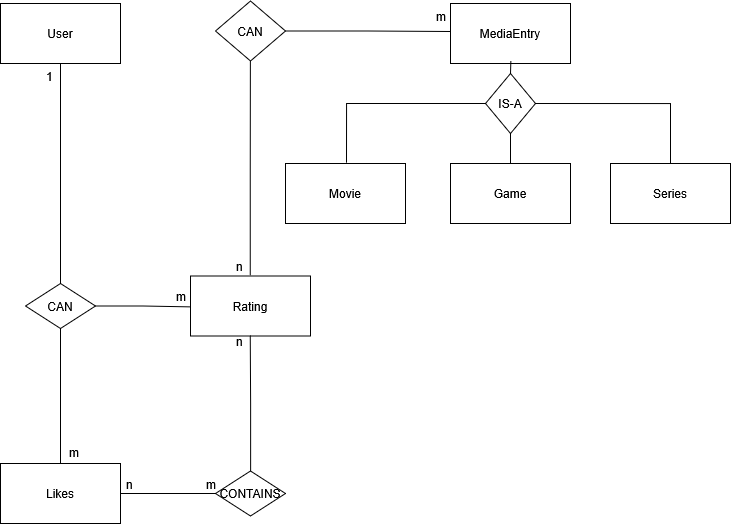
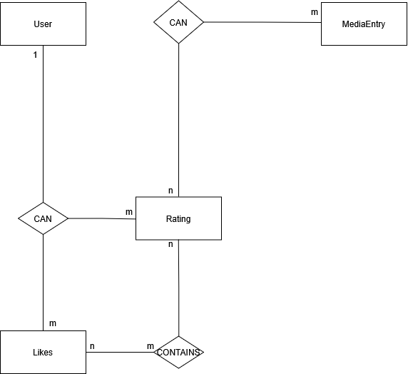

# Development Protocol
## Database Design + Docker
Ich habe ein simples ER-esque Diagramm zur Orientierung gezeichnet und habe es von meinem Prof prüfen lassen. Es sah ungefähr so aus:

 

Ich hatte Filme, Spiele und Serien als separate Tabellen mit Vererbung modelliert.
Um die Komplexität zu reduzieren und die Persistenzlogik zu vereinfachen, habe ich das Design
zu einer einzigen media_entry-Tabelle mit einer media_type-Spalte und einer Enumeration im Code geändert.
Dies erfüllt weiterhin die Anforderungen und hält gleichzeitig die Implementierung wartbar. Danach sah meine Datenbank so aus:

Note: JOIN-Tabellen habe ich aktuell nicht grafisch dargestellt.

## Models
Ich habe für jede Entity das Bilder Pattern implementiert, da durch das Pattern eine strikte Vorgabe beim Kreieren befolgt werden muss.
Die Chancen sind so geringer, dass "Müll Objekte" in der Datenbank landen. Beim Erstellen, der Entities musste ich aufpassen, dass die 
Attributnamen auch mit Spaltennamen kompatibel sind. Ich will somit Probleme bei der Serialisierung mit Jackson vermeiden.

## Repositories
Für die Intermediate Abgabe, habe ich mich dazu entschieden nur die Grundfunktionen (CRUD) für MediaEntry zu erstellen:
- save() (CREATE)
- findId() (READ)
- findAll() (READ)
- update() (UPDATE)
- delete() (DELETE)
Zusätzlich entschied ich mich dazu, die Datenbank Connection über den Konstruktor zu injizieren, 
damit vermeide ich mit jedem CRUD Aufruf eine neue Datenbankverbindung aufzubauen.

## Authorization
Authentifizierung und Autorisierung sind geplant, aber in der Intermediate Version noch nicht implementiert.

## Controller + Services
Beide Layer sind noch in der Rohphase. Das HTTP-Routing habe ich der Spezifikation übernommen. Die Responses und Header 
sind noch fast leer, aber das wird für die nächste Abgabe abgeändert. Business logic Implementierung ist für den 
Service Layer geplant, zwecks Leserlichkeit und das Einhalten des Software-Designprinzips SOLID.

---

## Estimated times
This is the time it roughly took for each part:
- Database modelling + Implementation: 2h
- Repository implementation: ~1h
- Service implementation: ~1h
- Controller implementation: ~5h
- Token-based authorization: ~Xh
- Unit test planning + implementation:
- Documentation: ~30min
- **Honorable mention** - Debugging: