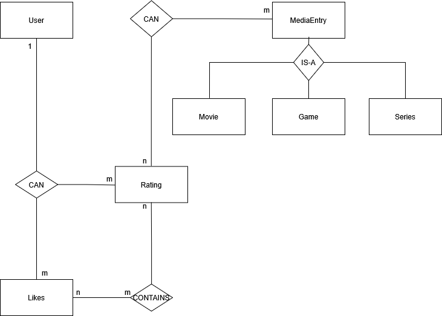
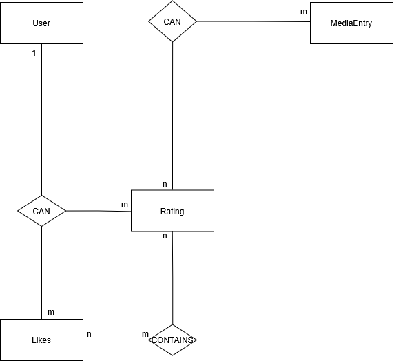
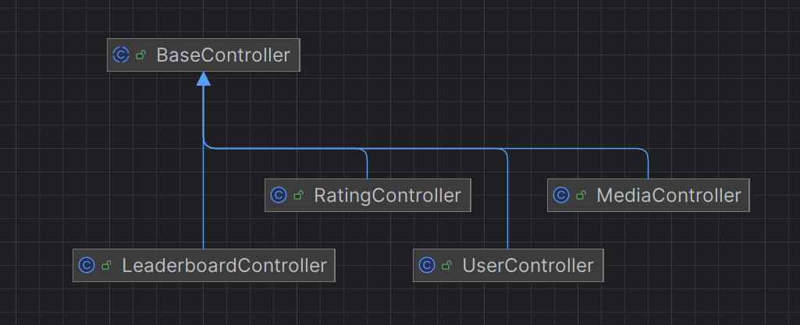
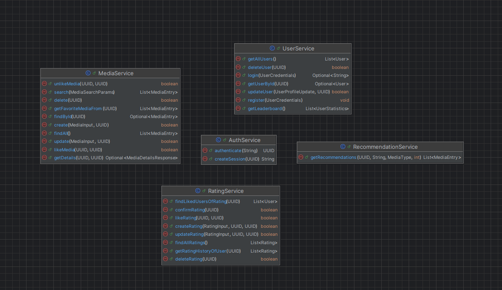
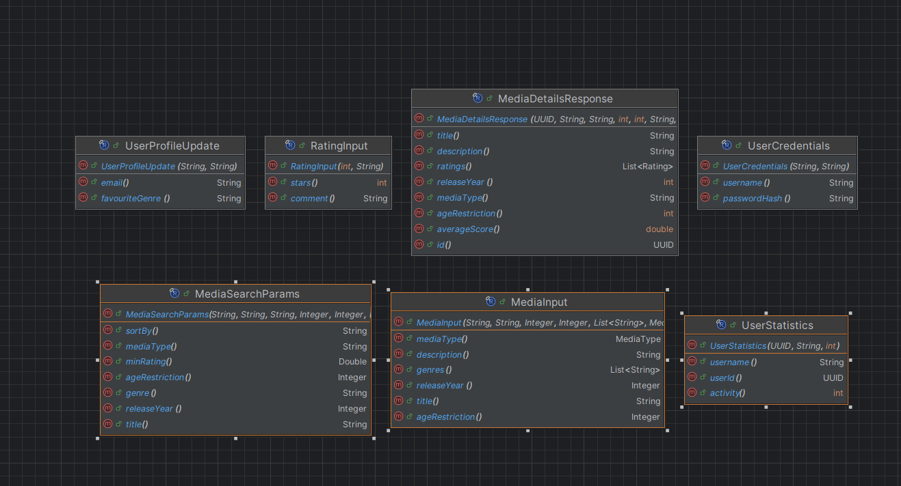
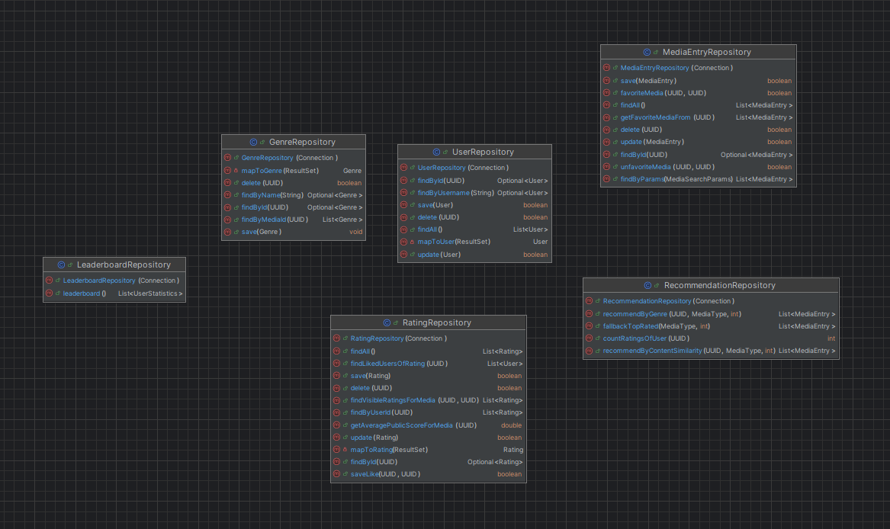
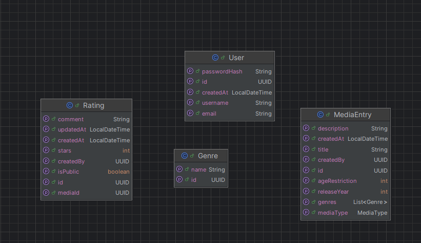

# Development Protocol
## Database Design + Docker
Ich habe ein simples ER-esque Diagramm zur Orientierung gezeichnet und habe es von meinem Prof prüfen lassen. Es sah ungefähr so aus:

 

Ich hatte Filme, Spiele und Serien als separate Tabellen mit Vererbung modelliert.
Um die Komplexität zu reduzieren und die Persistenzlogik zu vereinfachen, habe ich das Design
zu einer einzigen media_entry-Tabelle mit einer media_type-Spalte und einer Enumeration im Code geändert.
Dies erfüllt weiterhin die Anforderungen und hält gleichzeitig die Implementierung wartbar. Danach sah meine Datenbank so aus:



Note: JOIN-Tabellen habe ich nicht grafisch dargestellt.
Ich musste im Laufe des Projekt Attribute in die Tabellen hinzufügen, weil meine Planung nicht genau genug war. 
Das möchte ich in Zukunft vermeiden.

## Models
Ich habe für jede Entity das Builder Pattern implementiert, da durch das Pattern eine strikte Vorgabe beim Kreieren befolgt werden muss.
Die Chancen sind so geringer, dass "Müll Objekte" in der Datenbank landen. Beim Erstellen, der Entities musste ich aufpassen, dass die 
Attributnamen auch mit Spaltennamen kompatibel sind. Ich will somit Probleme bei der Serialisierung mit Jackson vermeiden.

## Repositories
Ich habe mich dazu entschieden die Grundfunktionen (CRUD) und extra Helper-queries für MediaEntry zu erstellen. Das sind
die Grundfunktion, die jedem Repository vorhanden sind:
- save() (CREATE)
- findId() (READ)
- findAll() (READ)
- update() (UPDATE)
- delete() (DELETE)

Zusätzlich entschied ich mich dazu, die Datenbank Connection über den Konstruktor zu injizieren, 
damit vermeide ich mit jedem CRUD Aufruf eine neue Datenbankverbindung aufzubauen.

## Controller + Services
Zuerst habe ich mich an die Controller gesetzt und "hinunter" gearbeitet. Ich habe jeden Endpunkt laut API abgearbeitet 
und zwischendurch mti Postman die Endpunkte getestet.

DTOs habe ich als Records erstellt, weil die schwieriger zu manipulieren sind aufgrund ihrer privat & finalen Feldern.
Setter gibt es nicht. Das HTTP-Routing habe ich der Spezifikation übernommen. Ich habe mich nicht immer an die Spezifikation
gehalten, denn manchmal war es mir wichtig einen längeren Text in der Response zu haben.
Business logic Implementierung ist für den Service Layer geplant und muss noch fertig geschrieben werden.

Getestet wurde die Applikation mit den gegebenen Postman Requests, wie zb. : POST http://localhost:8080/api/users/login/ 
```json
{
    "username":"system_user",
    "passwordHash":"password"
}
```
## Final Architecture







Wenn Intellij Ultimate verwendet wird, dann mache folgendes um die gesamte Architektur zu sehen:
- Rechts klick auf den root folder
- Klick auf "Diagrams"
- Klick auf "Show Diagram"

---

## Estimated times:
- Database modelling + Implementation: 5h
- Repository implementation: ~3h
- Service implementation: ~9h
- Controller implementation: ~16h
- Token-based authorization: ~2h
- Unit test planning + implementation: 2.5h
- Documentation: ~5h
- **Honorable mention** - Debugging: 15h

## Lessons learned:
- Ich arbeite nicht mehr in die Nacht hinein.
- Ich folge gerne einem Workflow (Model -> Controller -> Service -> Repo).
- Lieber ein DTO zu viel als zu wenig.
- Datenbank Design schon vor dem Start der Implementierung fertig haben. In diesem Projekt lief das parallel und das 
war keine gute Idee.
- Genug Zeit für Unit tests einplanen (!!)

